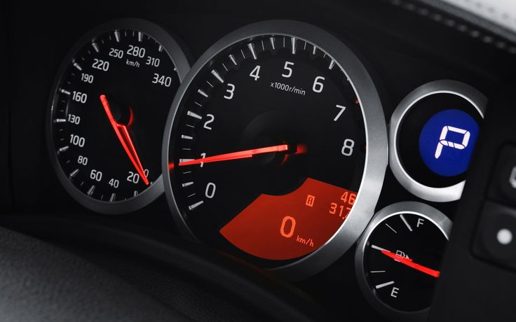
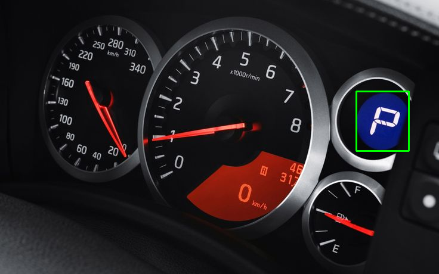

# Template Matching with OpenCV

This Python application uses **OpenCV** to perform **template matching** on an image. It allows users to find and verify template images within a larger original image. When a match is found, it draws a rectangle around the detected area and saves the result.

## Features

* **Template Matching**: Detects a smaller template image within a larger original image.
* **Verification**: Compares cropped regions with the template to verify accuracy.
* **Result Saving**: Draws a rectangle around the detected area and saves the result with a timestamped filename.
* **Color Validation**: Ensures that the original image and the template are either both color images or both grayscale.

## Requirements

* Python 3.x
* OpenCV
* NumPy

You can install the required dependencies using `pip`:

```bash
pip install opencv-python numpy
```

## How to Use

1. **Clone this repository** or download the script to your local machine.

2. **Run the script**:

   ```bash
   python app.py
   ```

3. **Enter the paths of the images**:
   When prompted, enter the full paths to the **original image** and the **template image**. The paths should look something like:

   * `C:\Users\admin\Desktop\images\original_image.png`
   * `C:\Users\admin\Desktop\images\template_image.png`

4. **Output**:
   The script will:

   * Perform template matching and display a **confidence score** of the match.
   * If the match is successful, it will draw a rectangle around the detected area in the original image and save the result in a folder called `template_matches/`.

   Example output filename:

   ```
   detected_original_image_20230506_153012.png
   ```

## How It Works

* **Step 1: Load Images**
  The script prompts you to input paths for the original image and the template image.

* **Step 2: Color Validation**
  It checks whether both images are either color or grayscale. If they are of different types, it will notify you and stop.

* **Step 3: Template Matching**
  The script uses OpenCV's `cv2.matchTemplate` function to find the template inside the original image. The initial confidence score is calculated.

* **Step 4: Cropped Region Verification**
  If the match score is good enough, it crops the region from the original image and compares it with the template to confirm the match.

* **Step 5: Save the Result**
  If a match is found and verified, it draws a rectangle around the detected object and saves the result image.


  ## Example Demonstration

### 🔹 Original Image


### 🔹 Template Image


### 🔹 Matched Result (with rectangle)



## Example Output

```bash
Template matching confidence score: 0.9256
Object detected and saved as: template_matches\detected_original_image_20230506_153012.png
```

## Notes

* Ensure the paths to your images are correct.
* The script uses OpenCV's template matching method (`cv2.TM_CCOEFF_NORMED`), which compares the template image to sections of the original image.
* The `match_threshold` is set to 0.9 by default. You can adjust it based on the accuracy required.

## License

This project is open-source and available under the MIT License. See the LICENSE file for more details.
